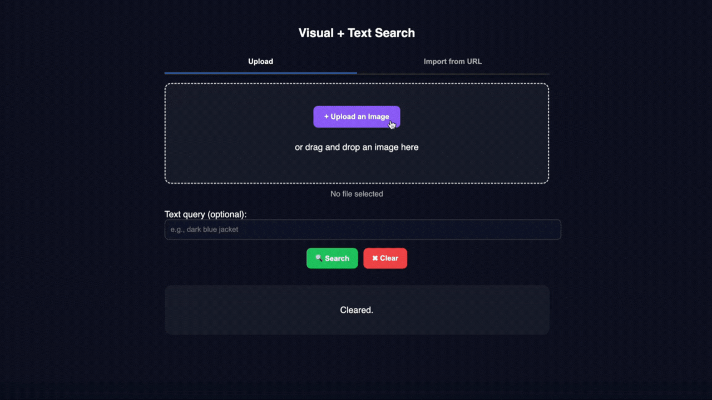

# 🧭 Project Overview
This project demonstrates a **multimodal product search system**:  
- You provide either an image (mandatory, can be uploaded from local device or via URL) and/or a text query (optional). 
- The system performs a **nearest neighbor search** in a **vector database** built with [Annoy](https://github.com/spotify/annoy).  
- It combines BERT (text embeddings) + DINOv2 (image embeddings), aligned via ONNX/Triton Inference Server for fast inference. (The source images are from [GLAMI-1M](https://github.com/glami/glami-1m))
- The best-matching product metadata (from **MongoDB**) is returned.  

---
# 🚀 Deployment with Docker Compose

We provide a `docker-compose.yml` that runs the whole pipeline:

- **MongoDB** → Stores product metadata and vectors.  
- **Triton Inference Server** → Runs the ONNX model for fast aligned embedding.  
- **App (FastAPI)** → Handles API requests and frontend.  

## 1. Clone the repository
```bash
git clone https://github.com/<your-repo>.git
cd <your-repo>
```

## 2. Build and start all services
```bash
docker compose up --build
```

This will start:

- mongodb → on port 27017

- triton → on ports 8000, 8001, 8002

- app (FastAPI) → on port 8080

## 3. Access the system

API Docs (Swagger UI): 👉 http://localhost:8080/docs

Frontend (demo UI): 👉 http://localhost:8080/

## 4. Live Demo


# ⚙️ How it Works
### 1. Data

Products (brand, title, category, image) are stored in MongoDB.

Example:
```bash
{
  "name": "Casio Quartz Analog Watch",
  "category": "Watches",
  "image_file": "0.jpg",
  "image_url": "https://pub-6cf2f88db8f14219bf79c4d284c2c63e.r2.dev/0.jpg",
  "id": 0
},
```
### 2. Indexing

- At app startup, products are **seeded** into MongoDB.

- `Annoy` builds an **approximate nearest neighbor (ANN)** index:

  - **BERT** → encodes text (name + category).

  - **DINOv2** → encodes images.

  - Both embeddings are normalized and concatenated → stored in index.

### 3. Query

API `/search` accepts:

- Uploaded image file or image URL (required)

- Text query (optional)

Example request:
```bash
curl -X POST "http://localhost:8080/search" \
  -F "image_url=https://pub-xxx.r2.dev/1.jpg" \
  -F "query_text=dark blue jacket"
```
Example response:
```bash
{
  "results": [
    {
      "id": "123",
      "name": "CMP Jacket",
      "category": "Outdoor",
      "image_url": "https://...",
      "similarity": 0.4231
    }
  ]
}
```

# 🛠️ Development Notes

- Configuration is set in app/config.py and can be overridden by Docker env variables:
  - `DEV_MODE`

  - `MONGO_URI`

  - `TRITON_URL`

  - `INDEX_PATH`

  - `ID_MAP_PATH`

  - `SAMPLE_SIZE` (Indexing sample size. Use a positive integer to index a subset of products, or -1 to index all available products.)

- **Frontend** is served via FastAPI static files (`/frontend`).

- **Swagger UI** makes testing APIs easier.

   ## Disclaimer
   
   This project is for personal or educational use only.
All product images and data belong to their respective owners.
Only 194 images and the corresponding metadata from the open source data GLAMI-1M-dataset are stored in self-hosted Cloudflare R2, and 5 test images are only used for this project's test purpose.